<p align="center">
  
</p>

<h1 align="center">PITWALL</h1>
<p align="center"><b>When do you pit? A stochastic answer.</b></p>

<p align="center">
  <a href="https://github.com/claudialbombin/pitwall-simulator/actions/workflows/ci.yml"></a>
  <a href="https://github.com/claudialbombin/pitwall-simulator/actions/workflows/deploy.yml"></a>
  
  <a href="LICENSE"></a>
</p>

F1 pit-stop timing formulated as a finite-horizon **Markov Decision Process**, solved by backward induction, with tyre degradation modelled by **Gaussian Process regression** and safety-car risk modelled as a **Bayesian non-homogeneous Poisson process**. The optimal-stopping structure turns out to be isomorphic to pricing an American option, so the same machinery used to value early exercise on Wall Street tells you when to bring a Formula 1 car into the pits.

Backtested against the actual 2023 season, the resulting policy beats the strategy the real team called in **71% of races**, saving a mean of **4.2 seconds** per race.

---

## Contents

- [The garage](#the-garage)
- [What this actually does](#what-this-actually-does)
- [The math](#the-math)
- [Project layout](#project-layout)
- [Results](#results)
- [Live timing](#live-timing)
- [Installation](#installation)
- [Usage](#usage)
- [The website](#the-website)
- [Paper](#paper)
- [License](#license)

---

## The garage

Four fully-animated, self-contained SVGs — no video, no canvas, just CSS keyframes, so they animate right here in this README exactly as they do on the site.

<p align="center">
  <br>
  <sub>Pit stop — side view: jack in, gun off, wheel swap, gun on, launch.</sub>
</p>

<p align="center">
  
  <br>
  <sub>Pit stop — top view (all four corners at once) · Flat out — passing at speed</sub>
</p>

<p align="center">
  <br>
  <sub>Corner &amp; drift — rear tyres past the limit, smoke, fading skid marks</sub>
</p>

Play with all four — switch scenarios, change playback speed, hover a part to highlight it — in **[the interactive garage](https://claudialbombin.github.io/pitwall-simulator/garage.html)**.

## What this actually does

A race strategist has to decide, lap by lap, whether to stay out on ageing tyres or pit for fresh ones — trading a guaranteed ~20-25 second pit-lane loss now against an uncertain amount of lap-time loss later from degrading rubber, with the added wrinkle that a safety car can appear at any moment and make an otherwise-bad pit lap suddenly free. Pitwall treats this as a sequential decision problem under uncertainty and solves it exactly rather than by rule of thumb:

- **State**: lap number, tyre age, compound, gap to cars ahead/behind, number of stops already taken.
- **Decision**: pit now or stay out, at every lap.
- **Uncertainty**: how fast the tyre degrades (fitted per compound and circuit), and whether a safety car appears (fitted per circuit from historical rates).
- **Objective**: minimise expected total race time.

The MDP is solved by backward induction over the full state space to produce an optimal pit-lap policy, which is then validated by running thousands of Monte Carlo race simulations against both the policy and simpler baseline heuristics, and finally checked against what actually happened in real 2023 races.

## The math

Full derivations live in the [paper](#paper); the short version:

**MDP formulation.** The race is a finite-horizon MDP over laps. The value function satisfies a Bellman equation comparing the cost of pitting now against the expected cost of staying out one more lap and re-deciding; backward induction from the final lap gives the optimal pit-lap policy for every reachable state. See `core/mdp.py` for the state-space design and `core/solver.py` for the backward-induction solver.

**Tyre degradation.** Lap-time loss from tyre wear is modelled with a Weibull hazard, fitted per compound so that the degradation "cliff" — the point past which pace falls off sharply — lands at the empirically observed lap for that compound. A Gaussian Process (Matérn 5/2 kernel) is layered on top to capture circuit- and temperature-dependent variation the parametric fit misses. See `core/tyre_model.py`.

**Safety car risk.** Safety car appearances are modelled as a non-homogeneous Poisson process with a Bayesian Beta-Binomial layer estimating per-circuit deployment rate, so a lap under safety car risk is priced correctly into the pit/stay decision — since a pit stop taken under a safety car is nearly free in time lost. See `core/safety_car.py`.

**Monte Carlo validation.** The policy is validated over 10,000 simulated race trajectories per scenario, using antithetic variates to reduce estimator variance for a given sample budget. See `core/race_sim.py`.

**Isomorphism with quantitative finance.** The pit/stay decision is structurally the same problem as deciding whether to exercise an American option early: both compare an immediate, known payoff against the expected value of waiting under uncertainty, and both are solved with a Snell-envelope-style backward recursion. The paper works this correspondence through in detail — it's the same reason optimal-stopping theory built for derivatives pricing carries over cleanly to a pit wall.

## Project layout

```
core/          MDP, backward-induction solver, tyre model, safety-car model, race simulator
data/          data pipeline (pitwall-fetch console script) built on FastF1
live/          live-timing companion — follows a session in real time via scheduled GitHub Actions
paper/         the full write-up (paper.tex / paper.pdf) with derivations and the 2023 backtest
results/       generated plots and the season backtest summary (results/backtest_summary.csv)
tests/         pytest suite
web/           the GitHub Pages site — simulator, explainer, live dashboard, garage
```

## Results

Backtested against the 2023 season (`results/backtest_summary.csv`, one row per driver per race — actual pit lap vs. MDP-recommended pit lap and the resulting time delta):

- MDP policy faster than the actual strategy called on the pit wall in **71%** of races
- **4.2 seconds** mean time saving per race across the backtest
- Consistent gains across circuits with very different pit-loss profiles (a stop costs roughly 19.4s at Monaco vs. roughly 24.3s at Monza — see `tests/test_mdp.py` for the exact pit-lane deltas used)

`results/` also contains the full diagnostic plot set: tyre degradation fits by compound (`01_*`), safety-car model calibration (`02_*`), and Monte Carlo / backtest validation (`03_*`), including the value-function heatmap and the optimal-pit-window chart.

## Live timing

`live/` follows a session as it happens, and does it for €0. Every 5 minutes, `.github/workflows/live-scheduler.yml` checks the hand-maintained calendar in `live/schedule.py`; when a session is live, it dispatches `.github/workflows/live-listener.yml`, which runs for the duration of that session and connects directly to the same undocumented `livetiming.formula1.com` SignalR feed FastF1 itself is built on (`live/signalr_client.py`) — no paid API, no login.

As lap data comes in, `live/state.py` keeps a running `RaceState`, and every few seconds `live/advisor.py` asks the *exact same* `core.solver.PitStopSolver` used offline what it would recommend right now, given the real gaps, tyres, and safety-car status. The snapshot is written to `live.json` and pushed to an orphan `live-data` branch (`live/publish.py`); `web/live.html` polls that file straight from `raw.githubusercontent.com`. No server, no database, nothing beyond the token GitHub already injects into every Action run. See [`live/README.md`](live/README.md) for the full write-up, and the [live dashboard](https://claudialbombin.github.io/pitwall-simulator/live.html) to watch it during a session.

## Installation

Requires Python ≥ 3.10.

```bash
git clone https://github.com/claudialbombin/pitwall-simulator.git
cd pitwall-simulator
pip install -e .

# for development (tests, linting, type-checking)
pip install -e ".[dev]"

# for the live-timing feature
pip install -e ".[live]"
```

## Usage

Fetch and cache the underlying F1 data:

```bash
pitwall-fetch
```

Run the test suite:

```bash
pytest
```

Explore the solver, tyre model, and safety-car model directly from `core/` — each module's docstring walks through the theory behind it alongside the implementation.

## The website

The `web/` directory is a static site (deployed via `.github/workflows/deploy.yml`) with:

- **[Simulator](https://claudialbombin.github.io/pitwall-simulator/simulator.html)** — run the MDP interactively against a chosen circuit and tyre allocation
- **[The Math](https://claudialbombin.github.io/pitwall-simulator/explainer.html)** — the derivations above, walked through visually
- **[Live](https://claudialbombin.github.io/pitwall-simulator/live.html)** — the live-timing dashboard
- **[Garage](https://claudialbombin.github.io/pitwall-simulator/garage.html)** — the animated gallery above, interactive

## Paper

The full derivation — MDP formulation, tyre degradation model, safety-car model, the options-pricing isomorphism, Monte Carlo validation, and the 2023 season backtest — is written up in [`paper/paper.pdf`](paper/paper.pdf) (source in `paper/paper.tex`).

## License

MIT — see [LICENSE](LICENSE).

---

<p align="center"><sub>Claudia Maria Lopez Bombin</sub></p>
